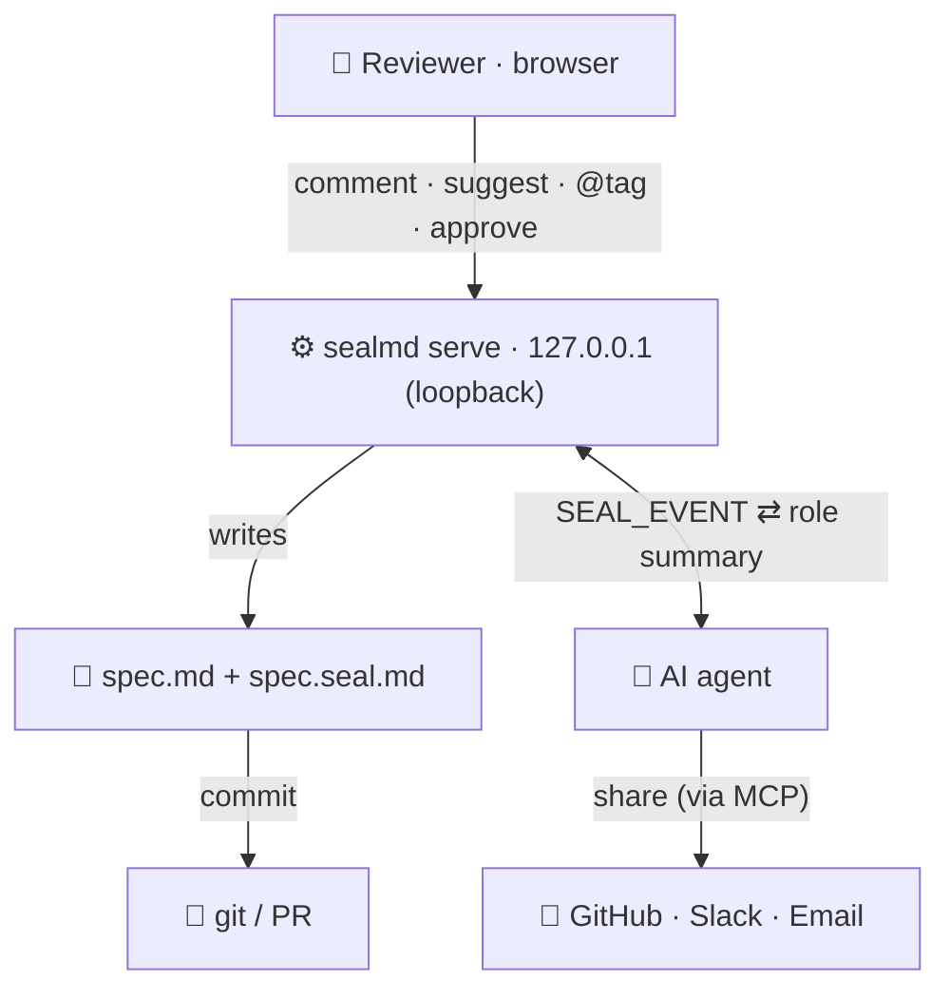

<div align="center">

# ◆ &nbsp;sealmd

### Turn a Markdown file into a sign-off-ready review — **fully local**.

*Two files. Zero servers. Zero network. Works with every AI coding agent.*

<br>

[](#)
[](#)
[](#)
[](LICENSE)
[](#)

**Claude Code** · **Cursor** · **OpenAI Codex** · **GitHub Copilot**

<br>

```bash
node skills/seal-review/scripts/seal.mjs serve --in spec.md --open
```

</div>

---

## Why

Your agent writes a PRD, a spec, an RFC. Then a human has to **actually approve it** — and a 6,000-word doc nobody reads is a rubber stamp, not a review.

**sealmd** makes that review real, without a SaaS, an account, or a single network call:

- 📄 **A doc, not a dashboard** — a calm, paper-feeling page a busy reviewer signs off in minutes.
- ⚡ **~90-second summary, tailored to *your* role** — Compliance sees compliance; Eng sees architecture.
- 💬 **Comment & suggest right on the text** — select a span, leave a note or a proposed edit.
- ✅ **Real sign-off** — approvals bind to the content hash; edit the doc and approvals go *stale* on their own.
- 🔌 **No lock-in** — it's two Markdown files in your repo. Diff them, commit them, own them.

> Tamper-**evident**, not tamper-proof. The sidecar is plain text; git history is the real audit trail. Verified-identity approvals + a hosted shared link are the paid `seal publish` step — everything else is right here, free and offline.

---

## The model

```
spec.md            the document under review        ← committed
spec.seal.md       the sidecar: comments, suggestions, approvals, state   ← committed
spec.review.html   a self-contained review page     ← generated, gitignored
```

`spec.seal.md` is human-readable Markdown whose records are structured JSON blocks — readable in any editor, diffable in any PR, parseable by the tool.

---

## Quick start

```bash
git clone https://github.com/jonyster/sealmd
cd your-project
ENG="node /path/to/sealmd/skills/seal-review/scripts/seal.mjs"

$ENG init    --in spec.md                       # create the sidecar
$ENG comment --in spec.md --author you --body "tighten scope" --anchor "exact span from the doc"
$ENG submit  --in spec.md                        # put it up for sign-off
$ENG approve --in spec.md --approver lead --note "LGTM"
$ENG serve   --in spec.md --open                 # live, interactive review
```

Open the page → pick your **role** for a tailored summary → select text to **Comment / Suggest** → **Accept** a suggestion (it rewrites `spec.md`) → **Approve**.

---

## Works with any AI agent

The engine is one plain CLI, so the same tool drives them all — each just reads its own instruction file:

| Agent | Reads |
|---|---|
| **Claude Code** | `.claude-plugin/` + `skills/seal-review/SKILL.md` — install via `/plugin` |
| **Cursor** | `.cursor/rules/seal-review.mdc` |
| **OpenAI Codex** | `AGENTS.md` |
| **GitHub Copilot** | `.github/copilot-instructions.md` |

All point back to the canonical [`AGENTS.md`](AGENTS.md). Any of them just runs `node skills/seal-review/scripts/seal.mjs … --in doc.md`.

#### Claude Code
```
/plugin marketplace add jonyster/sealmd
/plugin install sealmd@sealmd
```

---

## How the live review works



A **loopback** server — never public. The page **writes your files**; each action streams a `SEAL_EVENT` to the agent, which writes back tailored summaries and shares via your MCPs. No backend of ours, no keys. Git is the transport between people.

---

## Features

| | |
|---|---|
| 🎯 **Role-tailored summaries** | Pick or type any role; the digest re-writes for it. Pills are sticky & editable. |
| 💬 **Anchored comments** | Select text → comment. Click a highlight → jump to its comment, and back. |
| ✏️ **Suggestions** | Propose `old → new`; **Accept** applies it straight to `spec.md`. |
| ✅ **Approvals** | Submit → approve / request changes, quorum, auto-stale on edit. |
| 🏷️ **@mentions** | Tag people (auto-scraped from the doc); notify via git, Slack, Teams, email. |
| 🔗 **Share** | GitHub / Slack / Email — gated on the MCPs you actually have connected. |
| 🌙 **Dark by default** | Calm-paper light + dark, remembers your choice. |
| 🔒 **Zero network** | The review page makes no external requests. Verifiable, offline, yours. |

---

## Guarantees

**Does** — content-bound comments/approvals (sha256 of the normalized doc), drift detection, parity-frozen hashing, a fully self-contained offline page.

**Does not** — verify identity (authors are self-asserted), make the sidecar immutable (it's editable text — `git diff` is the backstop), or guarantee delivery. Those are the hosted `seal publish` boundary.

---

## Roadmap

Fuzzy anchor relocation · `seal watch` auto-refresh · committed-HTML mode · git-provenance / signed-commit identity.

---

<div align="center">

**MIT** · built to be forked · PRs welcome

*Made for agents and the humans who sign off on their work.*

</div>
