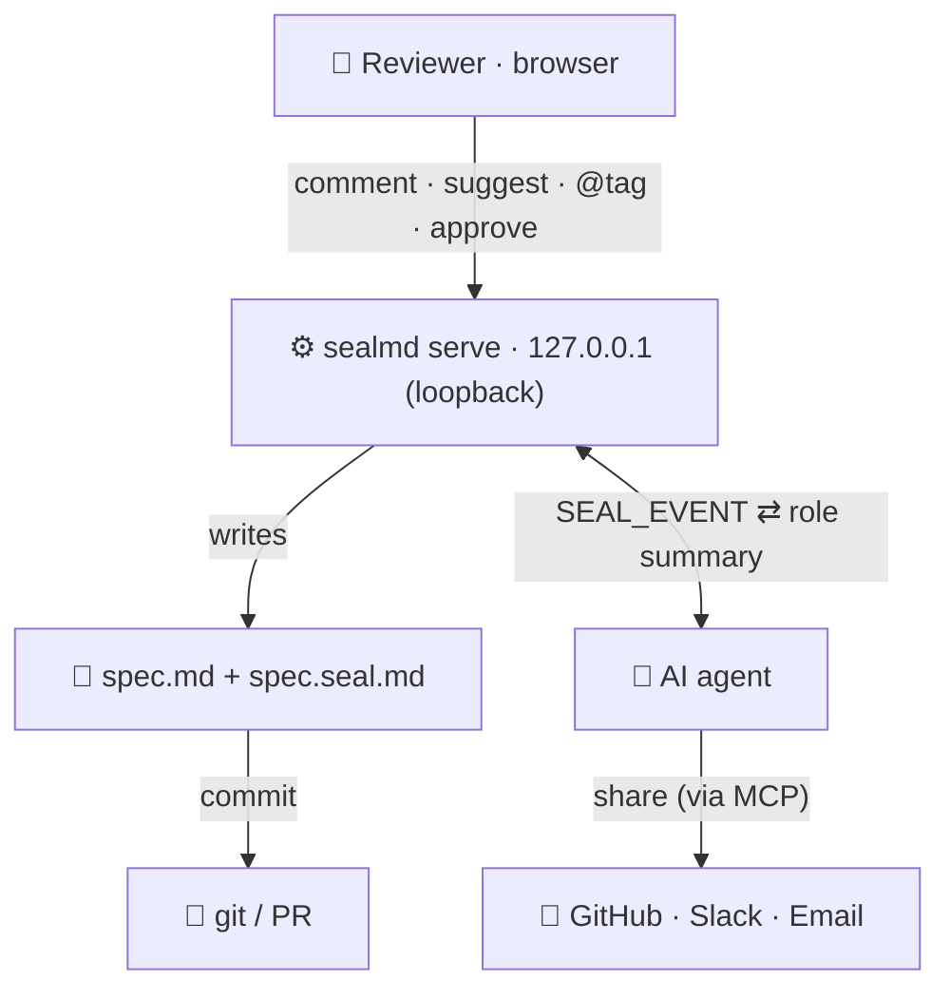

<div align="center">

# ◆ &nbsp;sealmd

### Your agent wrote the doc. Where did the review go?

*sealmd turns an agent-written Markdown doc into a sign-off-ready review that lives next to it in your repo — two committed files, reviewed and approved by real people.*

<br>

[](#)
[](#)
[](LICENSE)

<br>

```
/sealmd
```

<sub>Claude Code: install first (see <a href="#install-for-claude-code">Quick start</a>). Other agents: see <a href="AGENTS.md">AGENTS.md</a>.</sub>

</div>

---

## Why

Your agent writes a PRD, a spec, an RFC. Then a human has to **actually approve it** — and a 6,000-word doc nobody reads is a rubber stamp, not a review.

**sealmd** makes that review real, without a SaaS or an account:

- **A doc, not a dashboard** — a calm, paper-feeling page a busy reviewer reads in minutes.
- **~90-second summary your agent tailors to each reviewer's role** — Compliance sees compliance, Eng sees architecture (a generic one renders if you skip it).
- **Comment & suggest right on the text** — select a span, leave a note or a proposed edit.
- **Content-bound decisions** — approvals bind to the doc's content hash and go **stale** the next time the review is rendered after the text changes.
- **No lock-in** — it's two Markdown files in your repo. Diff them, commit them, own them.

> The local tier is **honest, not cryptographic**: authors are self-asserted and the sidecar is editable text — `git diff` and git history are the audit trail. Verified identity + a hosted shared link are the paid `seal publish` step. Everything else is right here, free.

---

## Who it's for

Anyone whose **agent produces docs that other people need to review and approve** — you run the agent (Claude Code, Cursor, Codex, Copilot); the reviewers just open a page (engineers can open a PR instead). You don't have to be an engineer; you do have to run an agent.

---

## The model

```
spec.md            the document under review                              ← committed
spec.seal.md       the sidecar: comments, suggestions, approvals, state   ← committed
spec.review.html   a self-contained review page                          ← generated, gitignored
```

`spec.seal.md` is human-readable Markdown whose records are structured JSON blocks — readable in any editor, diffable in any PR, parseable by the tool.

---

## Quick start

In **Claude Code** (or Cursor / Codex / Copilot), just say:

```
/sealmd spec.md
```

`/sealmd` is the only command most people need. **New doc** → it asks the owner,
your role, and how to share, then opens the live review. **Existing doc** → it
just opens it. (`/seal-new` and `/seal-open` are the explicit versions.)

In the page → pick a **role** for a tailored summary → select text to **Comment / Suggest** → **Accept** a suggestion (it rewrites `spec.md`) → **Approve**.

#### Install for Claude Code
```
/plugin marketplace add jonyster/sealmd
/plugin install sealmd@sealmd
```

<details>
<summary>Power users — drive the CLI directly</summary>

```bash
ENG="node /path/to/sealmd/skills/seal-review/scripts/seal.mjs"
$ENG start   spec.md                             # init-if-needed + open live review
$ENG comment --in spec.md --body "tighten scope" --anchor "exact span" --mention alice
$ENG submit  --in spec.md && $ENG approve --in spec.md --approver lead --note "LGTM"
```
</details>

<details>
<summary>Wire it into any AI agent</summary>

The engine is one plain CLI, so the same tool drives them all — each just reads its own instruction file:

| Agent | Reads |
|---|---|
| **Claude Code** | `.claude-plugin/` + `skills/seal-review/SKILL.md` — install via `/plugin` |
| **Cursor** | `.cursor/rules/seal-review.mdc` |
| **OpenAI Codex** | `AGENTS.md` |
| **GitHub Copilot** | `.github/copilot-instructions.md` |

All point back to the canonical [`AGENTS.md`](AGENTS.md).
</details>

---

## How the live review works



The review server binds `127.0.0.1` and token-authenticates every action. The page **writes your files**; each action streams a `SEAL_EVENT` to the agent, which writes back tailored summaries and shares via your MCPs. There's no backend of ours — the core review loop needs no keys; only opt-in email/Slack notifications do. Git is the transport between people.

---

## Features

| | |
|---|---|
| **Role-tailored summaries** | Pick or type a role; your agent writes the digest for it. A generic summary renders with no agent. |
| **Anchored comments** | Select text → comment. Click a highlight → jump to its comment, and back. |
| **Suggestions** | Propose `old → new`; **Accept** applies it straight to `spec.md`. |
| **Approvals** | Submit → approve / request changes, quorum, auto-stale on edit. |
| **@mentions** | Tag people (auto-scraped from the doc); notify via git, Slack, Teams, email. |
| **Share** | A GitHub PR (via local `gh`), a portable HTML file, or a paid hosted link. |
| **Dark by default** | Calm-paper light + dark, remembers your choice. |

---

## What it does — and doesn't

**Does** — content-bound comments/approvals (sha256 of the normalized doc), automatic drift detection on edit, parity-frozen hashing, and a self-contained offline review **file** that makes no network calls of its own.

**Doesn't** — verify identity (authors are self-asserted), make the sidecar immutable (it's editable text — `git diff` is the backstop), or guarantee notification delivery. Cryptographic identity and a real shared link are the hosted `seal publish` boundary.

> Two honest caveats: (1) the offline guarantee is about the generated `spec.review.html` **file** — while `seal serve` runs it is a local web server (loopback-bound and token-authenticated, but a server); (2) "no network calls" means none of its own — external images or links you put in the doc still load on open.

---

## Data handling

sealmd runs on your machine and stores everything in your own repo (`doc.md` + `doc.seal.md`). **No telemetry. Nothing is sent to the author or any sealmd service.**

The only outbound network is **opt-in notifications**, off by default:

| Channel | Fires when you set | Data sent | To |
|---|---|---|---|
| Slack / Teams | `--slack-webhook` / `--teams-webhook` (or `SEAL_*_WEBHOOK`) | event text (who/what/doc title) | the webhook **you** provide |
| Email | `SEAL_RESEND_KEY` + `--email-to` | event text | [Resend](https://resend.com) under **your** key |
| Share / sync | your connected MCP (GitHub, etc.) or local `gh` CLI | what that channel sends | the service **you** connected |

Webhook URLs and keys live in `*.seal.notify.json`, which is gitignored. Remove the flags/env and the tool makes zero outbound calls.

---

## Roadmap

Fuzzy anchor relocation · `seal watch` auto-refresh · committed-HTML mode · git-provenance / signed-commit identity.

---

<div align="center">

**MIT** · built to be forked · PRs welcome

*For the agents that write the docs — and the people who sign off on them.*

</div>
